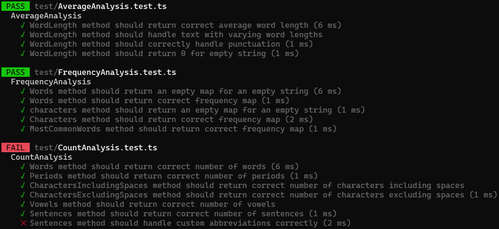

# Testrapport
## Sammanfattning
Detta testrapport sammanfattar resultatet av enhetstester som genomförts för modulerna `AverageAnalysis`, `FrequencyAnalysis` och `CountAnalysis`. Testerna genomfördes för att verifiera att de olika modulernas metoder fungerar på ett korrekt sätt. Det som testades var att få ut en genomsnittlig ordlängd, frekvensanalys av antalet ord, samt beräkning av olika element i en textsträng.

Av alla tester var det ett som misslyckades i modulen `CountAnalysis` och mer specifikt hanteringen av specialanpassade förkortningar i `sentences`.

### Testexekvering

**Testmiljö**: Jest

### AverageAnalysis
- **Status**: godkänd
- **Exekveringstid**: 9 ms
- **Tester**:
  - `WordLength` metoden returnerar en korrekt genomsnittslig ordlängd för samtliga ord.
  - `WordLength` metoden hanterar ord av varierande längd.
  - `WordLength` metoden hanterar punkter på ett korrekt sätt.
  - `WordLength` metoden returnerar 0 när strängen är tom.
- **Kommentar**: Alla tester passerade med godkänt resultat. Detta bekräftar att metoden `wordLength` fungerar korrekt för indata av varierande storlekar, tomma strängar samt för punkter.

### FrequencyAnalysis
- **Status**: Pass
- **Exekveringstid**: 9 ms
- **Tester**:
  - `Words` metoden returnerar en tom map när strängen är tom.
  - `Words` metoden returnerar en korrekt frekvenskarta.
  - `Characters` metoden returnerar en tom map när strängen är tom.
  - `Characters` metoden returnerar en korrekt frekvenskarta.
  - `MostCommonWords` metoden returnerar en korrekt frekvenskarta med rätt antal ord.
- **Kommentar**: Alla frekvensbaserade metoder passerade med godkänt resultat. Detta bekräftar att metoden genererar frekvenskartor på ett korrekt sätt.

### CountAnalysis
- **Status**: Underkänd
- **Exekveringstid**: 14 ms
- **Tester**:
  - `Words` metoden returnerar korrekt antal ord.
  - `Periods` metoden returnerar korrekt antal punkter.
  - `CharactersIncludingSpaces` metoden returnerar ett korrekt antal tecken med mellanslag inkluderat.
  - `CharactersExcludingSpaces` metoden reurnerar ett korrekt antal tecken med mellanslag exkluderat.
  - `Vowels` metoden returnerar korrekt antal vokaler.
  - `Sentences` metoden returnerar korrekt antal meningar.
  - Failure: `Sentences` metoden misslyckas med att returnerar korrekt antal meningar när abbreviations skickas med som argument.
- **Kommentar**: Merparten av räkningsbaserade metoder passerade med godkänt resultat. Dock så passerar inte `sentences` när förkortningar skickas med som ett argument till metoden.

## Slutsats
Testsviterna för `AverageAnalysis` och `FrequencyAnalysis` passerade med ett godkänt resultat. Därav kan man konstatera att de modulerna fungerar på ett tillförlitligt sätt för de avsedda användningsområdena.

Det som inte fungerade helt korrekt var `CountAnalysis`, närmare bestämt `sentences` metoden som inte klarade av att hantera specialanpassade förkortningar på ett korrekt sätt. Detta felet behöver och kommer att åtgärdas i kommande version av modulen. 

### Rekommendationer
- **Dokumentation**: Notera i README-filen för projektet att specialanpassade förkortningar inte bör användas för tillfället.
- **Felsökning**: Lös buggen som finns i `sentences` metoden, så att den även fungerar med specialanpassade förkortningar.

### Sammanfattning av körningen
- **Totalt antal körda tester**: 15
- **Tester godkända**: 14
- **Tester underkända**: 1
- **Sammanlagd status**: Delvis godkänd
